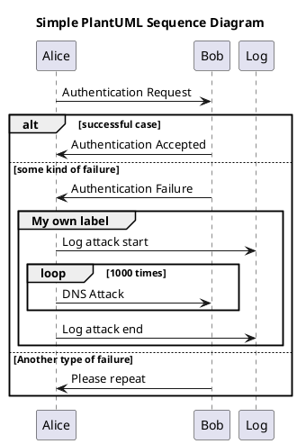
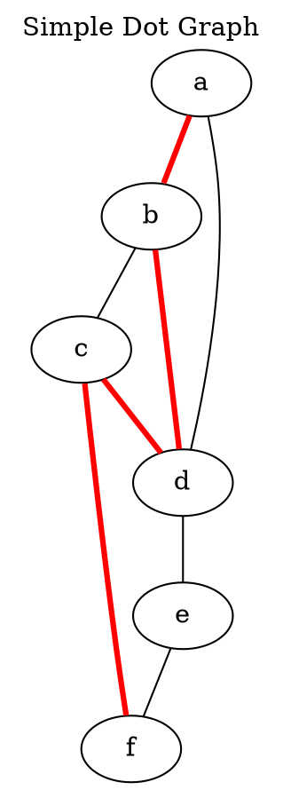
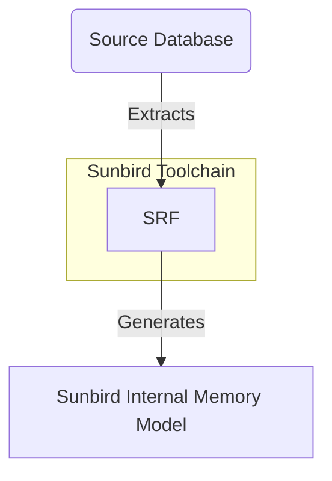

# The Support List of Diagramming Languages in Action

## Supported List
These are the supported list of languages.

* [plantuml](#plantuml-section)
* [dot/graphviz](#dot-section)
* [mermaid](#mermaid-section)
* [ditaa](#ditaa-section)
* [actdiag](#actdiag-section)
* [nwdiag](#nwdiag-section)
* [blockdiag](#blockdiag-section)
* [seqdiag](#seqdiag-section)
* [packetdiag](#packetdiag-section)
* [rackdiag](#rackdiag-section)

<br/>

---
<a name="plantuml-section"></a>
#### A Sample 'PlantUML' Script ####

    ```plantuml
    @startuml
    title: Simple PlantUML Sequence Diagram
    Alice -> Bob: Authentication Request

    alt successful case

        Bob -> Alice: Authentication Accepted
        
    else some kind of failure

        Bob -> Alice: Authentication Failure
        group My own label
            Alice -> Log : Log attack start
            loop 1000 times
                Alice -> Bob: DNS Attack
            end
            Alice -> Log : Log attack end
        end
        
    else Another type of failure

    Bob -> Alice: Please repeat
    
    end
    @enduml
    ```

If everything goes well, you should see a sequence diagram just below this line.



<br/>

---
<a name="dot-section"></a>
#### A Sample 'Dot' Script ####


    ```dot
    graph {
        labelloc="t";
        label="Simple Dot Graph";
        
        a -- b[color=red,penwidth=3.0];
        b -- c;
        c -- d[color=red,penwidth=3.0];
        d -- e;
        e -- f;
        a -- d;
        b -- d[color=red,penwidth=3.0];
        c -- f[color=red,penwidth=3.0];
    }
    ```

again, if everything goes well, you should see a diagram just below the this line.



<br/>

---
<a name="mermaid-section"></a>
#### A Sample 'Mermaid' Script ####


    ```mermaid
    graph TB
      X(Source Database) -->|Extracts| Y[SRF]
      Y --> |Generates| Z[Sunbird Internal Memory Model]

      subgraph Sunbird Toolchain
        Y
      end

    ```

again, if everything goes well, you should see a diagram just below the this line.



<br/>

---
<a name="ditaa-section"></a>
#### A Sample 'Ditaa' Script ####
    ```
                       +-------------+
                       | Asciidoctor |-------+
                       |   diagram   |       |
                       +-------------+       | PNG out
                           ^                 |
                           | ditaa in        |
                           |                 v
     +--------+   +--------+----+    /---------------\
     |        | --+ Asciidoctor +--> |               |
     |  Text  |   +-------------+    |   Beautiful   |
     |Document|   |   !magic!   |    |    Output     |
     |     {d}|   |             |    |               |
     +---+----+   +-------------+    \---------------/
         :                                   ^
         |          Lots of work             |
         +-----------------------------------+
    ```
    
again, if everything goes well, you should see a diagram just below the this line.

```ditaa

                   +-------------+
                   | Asciidoctor |-------+
                   |   diagram   |       |
                   +-------------+       | PNG out
                       ^                 |
                       | ditaa in        |
                       |                 v
 +--------+   +--------+----+    /---------------\
 |        | --+ Asciidoctor +--> |               |
 |  Text  |   +-------------+    |   Beautiful   |
 |Document|   |   !magic!   |    |    Output     |
 |     {d}|   |             |    |               |
 +---+----+   +-------------+    \---------------/
     :                                   ^
     |          Lots of work             |
     +-----------------------------------+
```

<br/>

---
<a name="nwdiag-section"></a>
#### A Sample 'nwdiag' Script ####
    ```
    nwdiag {
      network dmz {
          address = "210.x.x.x/24"

          web01 [address = "210.x.x.1"];
          web02 [address = "210.x.x.2"];
      }
      network internal {
          address = "172.x.x.x/24";

          web01 [address = "172.x.x.1"];
          web02 [address = "172.x.x.2"];
          db01;
          db02;
      }
    }
    ```
    
again, if everything goes well, you should see a diagram just below the this line.

```nwdiag
nwdiag {
  network dmz {
      address = "210.x.x.x/24"

      web01 [address = "210.x.x.1"];
      web02 [address = "210.x.x.2"];
  }
  network internal {
      address = "172.x.x.x/24";

      web01 [address = "172.x.x.1"];
      web02 [address = "172.x.x.2"];
      db01;
      db02;
  }
}
```

<br/>

---
<a name="actdiag-section"></a>
#### A Sample 'actdiag' Script ####
    ```
    actdiag {
      write -> convert -> image

      lane user {
         label = "User"
         write [label = "Writing reST"];
         image [label = "Get diagram IMAGE"];
      }
      lane actdiag {
         convert [label = "Convert reST to Image"];
      }
    }
    ```
    
again, if everything goes well, you should see a diagram just below the this line.

```actdiag
actdiag {
  write -> convert -> image

  lane user {
     label = "User"
     write [label = "Writing reST"];
     image [label = "Get diagram IMAGE"];
  }
  lane actdiag {
     convert [label = "Convert reST to Image"];
  }
}
```

<br/>

---
<a name="blockdiag-section"></a>
#### A Sample 'blockdiag' Script ####
    ```
    blockdiag {
      blockdiag -> generates -> "block-diagrams";
      blockdiag -> is -> "very easy!";

      blockdiag [color = "greenyellow"];
      "block-diagrams" [color = "pink"];
      "very easy!" [color = "orange"];
    }
    ```
    
again, if everything goes well, you should see a diagram just below the this line.

```blockdiag
blockdiag {
    blockdiag -> generates -> "block-diagrams";
    blockdiag -> is -> "very easy!";

    blockdiag [color = "greenyellow"];
    "block-diagrams" [color = "pink"];
    "very easy!" [color = "orange"];
}
```

<br/>

---
<a name="seqdiag-section"></a>
#### A Sample 'seqdiag' Script ####
    ```
    seqdiag {
      seqdiag -> "sequence-diagrams" [label = "generates"];
      seqdiag --> "is very easy!";
    }
    ```
    
again, if everything goes well, you should see a diagram just below the this line.

```seqdiag
seqdiag {
    seqdiag -> "sequence-diagrams" [label = "generates"];
    seqdiag --> "is very easy!";
}
```

<br/>

---
<a name="packetdiag-section"></a>
#### A Sample 'packetdiag' Script ####
    ```
    packetdiag {
       0-7: Source Port
       8-15: Destination Port
       16-31: Sequence Number
       32-47: Acknowledgment Number
    }
    ```
    
again, if everything goes well, you should see a diagram just below the this line.

```packetdiag
packetdiag {
   0-7: Source Port
   8-15: Destination Port
   16-31: Sequence Number
   32-47: Acknowledgment Number
}
```

<br/>

---
<a name="rackdiag-section"></a>
#### A Sample 'rackdiag' Script ####
    ```
	rackdiag {
	  // define height of rack
	  16U;

	  // define rack items
	  1: UPS [2U];
	  3: DB Server
	  4: Web Server
	  5: Web Server
	  6: Web Server
	  7: Load Balancer
	  8: L3 Switch
	}
    ```
    
again, if everything goes well, you should see a diagram just below the this line.

```rackdiag
rackdiag {
  // define height of rack
  16U;

  // define rack items
  1: UPS [2U];
  3: DB Server
  4: Web Server
  5: Web Server
  6: Web Server
  7: Load Balancer
  8: L3 Switch
}
```
